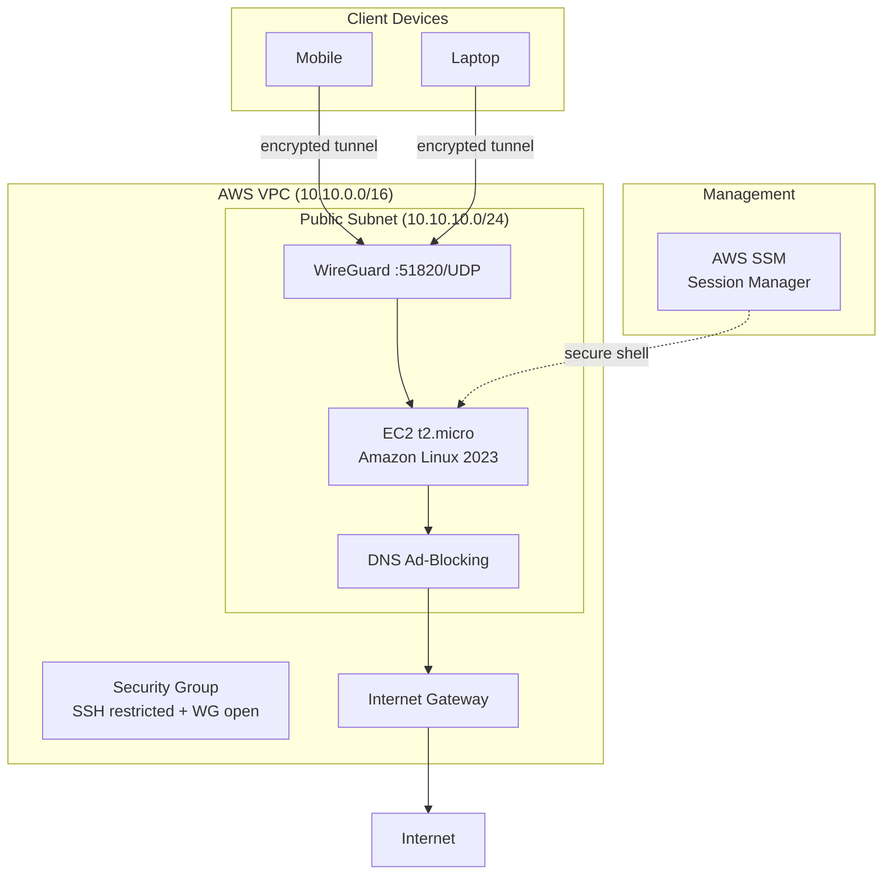

# Personal VPN + Ad-Blocking Infrastructure

## 1. Problem & Business Context

Public Wi-Fi networks expose traffic to interception. ISPs log DNS queries. Ad networks track browsing across sites. A personal VPN with DNS-level ad-blocking solves all three: encrypted tunnel for privacy, DNS filtering for ads/trackers, and a single controlled exit point for all traffic. This project provisions the AWS infrastructure to host that stack at minimal cost.


## 2. Solution Overview

Terraform-managed AWS infrastructure providing a WireGuard VPN endpoint in an isolated VPC. A single EC2 instance (t2.micro) runs WireGuard for encrypted tunneling and DNS-level ad-blocking for tracker/ad domain filtering. Systems Manager provides secure shell access without SSH key exposure. Total infrastructure cost is ~$9-12/month after free tier.


## 3. Architecture Diagram



Full architecture details: [docs/architecture.md](docs/architecture.md)


## 4. System Flow

**VPN traffic path:**
Client → WireGuard tunnel (UDP 51820, ChaCha20-Poly1305) → EC2 → DNS resolver → Internet

**DNS ad-blocking path:**
DNS query → local resolver on EC2 → if domain on blocklist: return 0.0.0.0 (blocked) → else: recursive lookup → return IP

**Management path:**
Operator → AWS SSM Session Manager → EC2 shell (no SSH keys needed)


## 5. Technology Stack & Rationale

| Technology | Role | Why |
|-----------|------|-----|
| Terraform (>=1.6.0, AWS ~>5.0) | IaC | Declarative, reproducible, state management |
| AWS VPC | Network isolation | Dedicated CIDR, blast radius containment |
| AWS EC2 (t2.micro) | VPN server | Free tier eligible, sufficient for single-user VPN |
| Amazon Linux 2023 | OS | Long-term support, minimal footprint, dnf package manager |
| WireGuard | VPN protocol | Kernel-level performance, 4000 LOC (auditable), modern crypto |
| DNS ad-blocking | Tracker/ad filtering | Network-level blocking, no client-side extensions needed |
| AWS SSM | Instance management | No SSH key exposure, CloudTrail audit trail |
| Security Groups | Access control | SSH restricted to operator IP, WireGuard open (crypto-authenticated) |


## 6. Key Decisions & Tradeoffs

| Decision | Tradeoff | Rationale |
|----------|----------|-----------|
| Custom VPC over default VPC | More Terraform resources vs. workload isolation | Blast radius containment if instance compromised |
| SSM + optional SSH | IAM dependency vs. no key management | Audit trail, no port 22 required |
| t2.micro over t3 | Older generation vs. free tier eligible | 12 months free, sufficient for single user |
| WireGuard over OpenVPN | Less feature-rich vs. kernel-level performance | Formally verified, minimal attack surface |
| Single AZ, no EIP | No auto-failover vs. lowest cost | Personal tool, manual recovery acceptable |
| Dynamic IP over Elastic IP | Client config update on restart vs. no idle cost | Instance runs 24/7, restarts are rare |

Full decision log: [docs/decisions.md](docs/decisions.md)


## 7. Challenges & Resolutions

| Challenge | Resolution |
|-----------|-----------|
| SSH default CIDR of 0.0.0.0/0 is insecure | Documented override requirement; README warns explicitly |
| WireGuard port open to all IPs | Intentional — WireGuard uses cryptographic authentication; unauthenticated packets silently dropped |
| No remote Terraform state | Accepted for single-developer project; state gitignored |
| Software installation not in Terraform | Separated IaC from config management; documented as manual post-deploy step |

Full lessons: [docs/lessons-learned.md](docs/lessons-learned.md)


## 8. Security Considerations

- VPC isolation: dedicated network, no shared resources with other workloads
- Security Group: SSH restricted to operator CIDR (`/32` recommended), WireGuard open (protocol-level auth)
- IAM role: minimal permissions (SSM core only — no S3, no EC2 describe, no admin)
- SSM Session Manager: preferred access method, no SSH key files on disk
- WireGuard: Curve25519 key exchange, ChaCha20-Poly1305 encryption, formally verified
- Secrets: `secrets/` directory gitignored, verified not tracked (`git ls-files` returns empty)
- No credentials in Terraform code — profile-based AWS auth, no hardcoded keys
- Terraform state gitignored (contains instance IDs, IPs)


## 9. Cost Considerations

| Resource | Estimated Monthly Cost | Notes |
|----------|----------------------|-------|
| EC2 t2.micro (730 hrs) | ~$8.47 | Free tier eligible for 12 months |
| EBS gp3 8GB | ~$0.80 | Default root volume |
| Data transfer (first 100GB) | $0 | Free tier |
| Data transfer (>100GB) | $0.09/GB | Unlikely for personal use |
| SSM | $0 | No additional cost |
| VPC/IGW/SG | $0 | No cost for networking resources |

**Total: ~$9-12/month** (after free tier expiration). During free tier: ~$0.80/month (EBS only).

[Estimates based on: 24/7 operation, single user, <100GB monthly transfer]

## 10. Future Improvements

- TODO: Add user_data script for automated WireGuard + Pi-hole installation (measure: time from `terraform apply` to working VPN)
- TODO: Add Terraform validation block to reject `0.0.0.0/0` as SSH CIDR
- TODO: Add VPC Flow Logs for network audit trail
- TODO: Add CloudWatch alarm for instance status check failures
- TODO: Consider Elastic IP or dynamic DNS for stable client configuration
- TODO: Add Ansible playbook as alternative to manual software configuration


## Quick Start

```bash
git clone https://github.com/cmorgan3324/vpn-adblock.git
cd vpn-adblock
```

Create `terraform.tfvars`:
```hcl
aws_region       = "us-east-1"
aws_profile      = "personal"
allowed_ssh_cidr = "YOUR_PUBLIC_IP/32"
```

Deploy:
```bash
terraform init
terraform plan
terraform apply
```

Access:
```bash
aws ssm start-session --target "$(terraform output -raw instance_id)"
```

## Tear Down

```bash
terraform destroy
```

## License

MIT — see [LICENSE](LICENSE)
