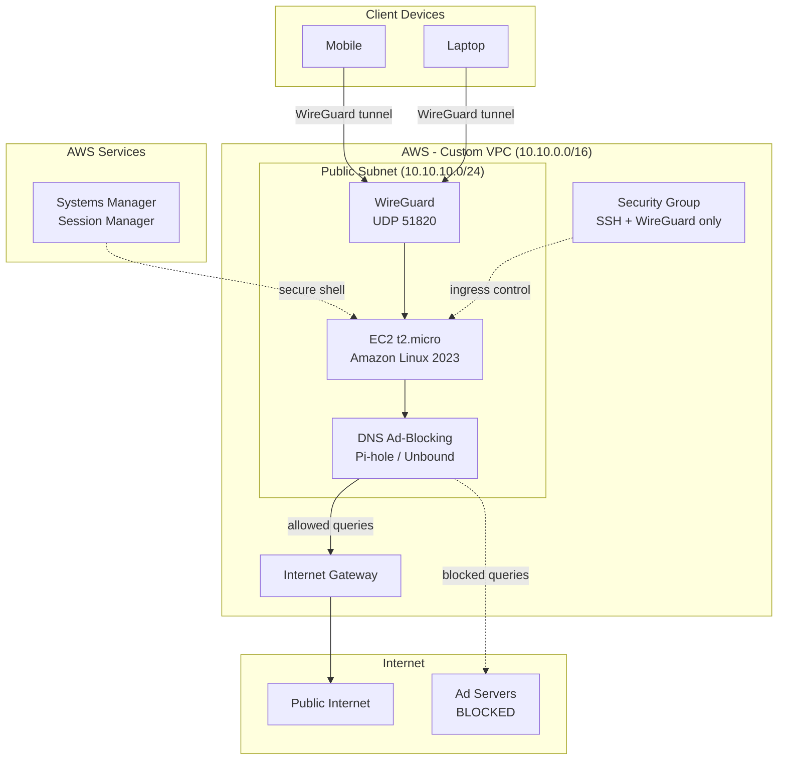
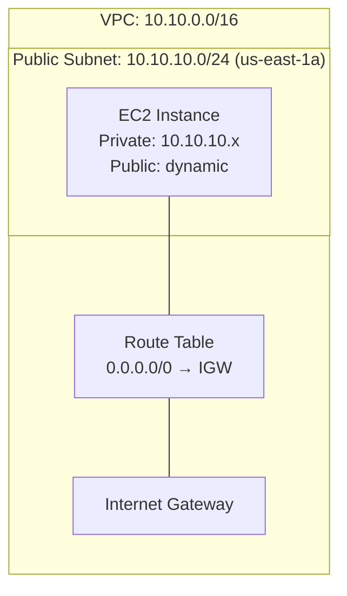
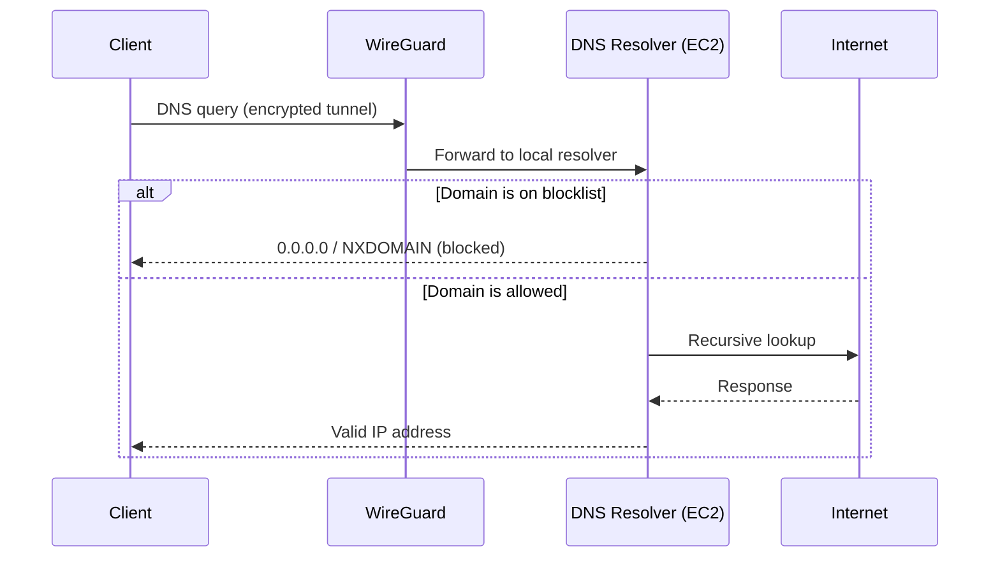

# Architecture

## System Overview

Single-EC2 personal VPN infrastructure on AWS providing encrypted tunnel access and DNS-level ad-blocking. All base infrastructure provisioned by Terraform; VPN and DNS software configured manually post-deploy.

## Architecture Diagram

## Network Topology

## DNS Path

## Component Details

### VPC & Networking (Terraform-managed)
- Custom VPC: `10.10.0.0/16`
- Public subnet: `10.10.10.0/24` in first available AZ
- Internet Gateway with default route
- Route table association for public subnet

### EC2 Instance (Terraform-managed)
- AMI: Amazon Linux 2023 (latest, x86_64, HVM)
- Instance type: `t2.micro` (free tier eligible)
- Public IP: auto-assigned (dynamic — changes on stop/start)
- User data: `dnf -y update` only (base OS patching)
- Key pair: optional (configurable via `enable_keypair` variable)

### Security Group (Terraform-managed)
| Rule | Port | Protocol | Source | Purpose |
|------|------|----------|--------|---------|
| Ingress | 22 | TCP | `var.allowed_ssh_cidr` | SSH fallback access |
| Ingress | 51820 | UDP | 0.0.0.0/0 | WireGuard VPN |
| Egress | All | All | 0.0.0.0/0 | Outbound traffic |

### IAM (Terraform-managed)
- Role: `personal-vpn-ssm-role`
- Policy: `AmazonSSMManagedInstanceCore` (managed policy)
- Instance profile attached to EC2

### WireGuard (Manual post-deploy)
- Protocol: UDP port 51820
- Key exchange: Curve25519
- Encryption: ChaCha20-Poly1305
- Configuration: `/etc/wireguard/wg0.conf`

### DNS Ad-Blocking (Manual post-deploy)
- [UNVERIFIED — specific software (Pi-hole vs Unbound) not confirmed in code]
- Blocks ad/tracking domains at DNS level
- Returns 0.0.0.0 or NXDOMAIN for blocked queries

## Source Files

- Infrastructure: `main.tf`, `variables.tf`, `outputs.tf`, `providers.tf`
- No CI/CD workflows
- No deployment scripts in Terraform
